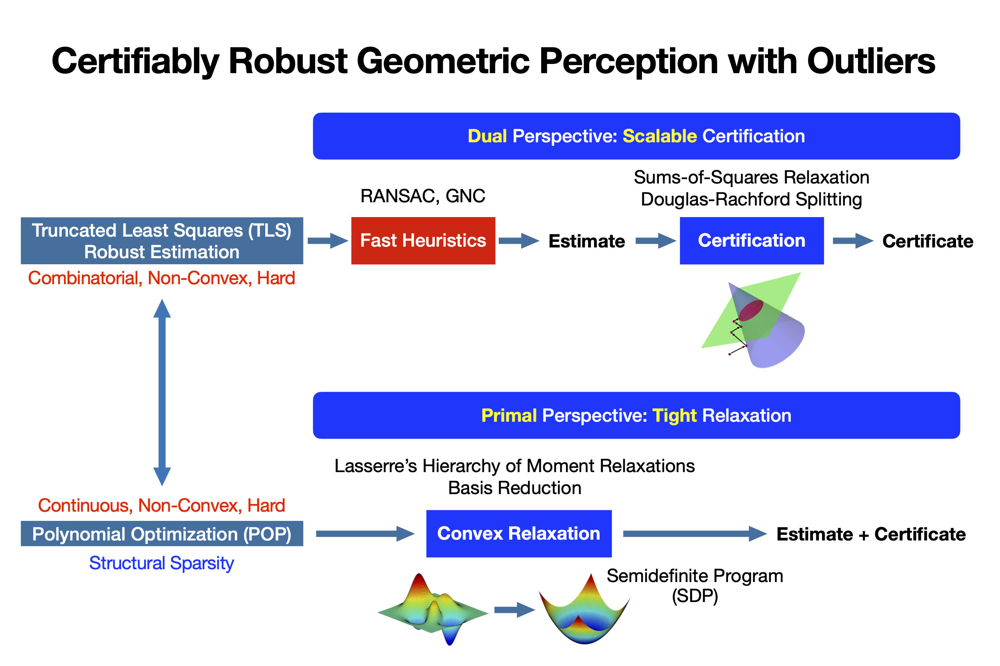

# One Ring to Rule Them All: Certifiably Robust Geometric Perception with Outliers

This repository is the official Matlab implementation of [One Ring to Rule Them All: Certifiably Robust Geometric Perception with Outliers](https://arxiv.org/abs/2006.06769), which has been accepted to be published in the 34th _Conference on Neural Information Processing Systems (NeurIPS)_, 2020.

If you find this implementation useful for your research, please cite:
```bibtex
@InProceedings{Yang20NeurIPS-CertifiablePerception,
    title={One Ring to Rule Them All: Certifiably Robust Geometric Perception with Outliers},
    author={Yang, Heng and Carlone, Luca},
    booktitle={Conference on Neural Information Processing Systems (NeurIPS)}
    year={2020},
    url = {https://github.com/MIT-SPARK/CertifiablyRobustPerception},
    pdf = {https://arxiv.org/abs/2006.06769}
}
```

## About

We propose a general framework for designing certifiable algorithms for a broad class of robust geometric perception problems. From the primal perspective, we apply Lasserre’s hierarchy of moment relaxations, together with basis reduction, to construct tight semidefinite relaxations to nonconvex robust estimation problems. From the dual perspective, we use SOS relaxation to convert the certification of a given candidate solution to a convex feasibility SDP, and then we leverage Douglas-Rachford Splitting to solve the feasibility SDP and compute a suboptimality for the candidate solution. Our primal relaxation is tight, and our dual certification is correct and scalable.

Currently, this repo implements the following solvers:

- Primal solvers (both dense and sparse convex relaxations)
- Dual solvers (Douglas-Rachford Splitting)
- Fast heuristics using [graduated non-convexity](https://arxiv.org/abs/1909.08605)

for four geometric perception problems (see the [paper](https://arxiv.org/abs/2006.06769) for details of their formulations):

- Single rotation averaging
- Shape alignment (image-based pose estimation)
- Point cloud registration
- Mesh registration

## Requirements
All the algorithms are implemented in Matlab.

Download the following packages:
- [YALMIP](https://yalmip.github.io) (for deriving dense and sparse moment relaxations)
- [SOSTOOLS](https://www.dropbox.com/s/qci9xf404u7nakl/SOSTOOLS.zip?dl=0) (for manipulating multivariate polynomials)
- [MOSEK](https://www.mosek.com/downloads/) (for solving the semidefinite programs)

and put them at the same level of this repo (eg., if this repo's path is `~/Code/CertifiablyRobustPerception` in your system, then YALMIP's path should be `~/Code/YALMIP` in your systm.)

## Examples

### Solve geometric perception using primal relaxation
Run examples in the `example_relaxation` folder. 

### Solve geometric perception using fast heuristics plus dual certification
Run examples in the `example_certification` folder. 


